# Exercise 2 - First Ansible Playbook

## Table of Contents

* [Objective](#objective)
* [Guide](#guide)
   * [Step 1 - Examine Ansible Playbook](#step-1---examine-ansible-playbook)
   * [Step 2 - Execute Ansible Playbook](#step-2---execute-ansible-playbook)
   * [Step 3 - Verify configuration on router](#step-3---verify-configuration-on-router)
   * [Step 4 - Validate idempotency](#step-4---validate-idempotency)
   * [Step 5 - Modify Ansible Playbook](#step-5---modify-ansible-playbook)
   * [Step 6 - Use check mode](#step-6---use-check-mode)
   * [Step 7 - Verify configuration is not present](#step-7---verify-configuration-is-not-present)
   * [Step 8 - Re-run the Ansible Playbook](#step-8---re-run-the-ansible-playbook)
   * [Step 9 - Verify configuration is applied](#step-9---verify-configuration-is-applied)
* [Takeaways](#takeaways)
* [Solution](#solution)
* [Complete](#complete)

## Objective

Use Ansible to update the configuration of routers.  This exercise will not create an Ansible Playbook, but use an existing one that has been provided.

This exercise will cover:

* examining an existing Ansible Playbook
* executing an Ansible Playbook on the controller
* check mode 
* verbose mode 

## Guide

### Step 1 - Examine Ansible Playbook

Navigate to the `network-workshop` directory if you are not already there in VS Code.

Open the `network-workshop` directory in Visual Studio Code:

  

Examine the provided Ansible Playbook named `playbook.yml`.  

```yaml
---
- name: snmp ro/rw string configuration
  hosts: cisco
  gather_facts: no

  tasks:

    - name: ensure that the desired snmp strings are present
      cisco.ios.config:
        commands:
          - snmp-server community ansible-public RO
          - snmp-server community ansible-private RW
```


We will explore in detail the components of an Ansible Playbook in the next exercise.  It is suffice for now to see that this playbook will run two Cisco IOS-XE commands

```sh
snmp-server community ansible-public RO
snmp-server community ansible-private RW
```

### Step 2 - Execute Ansible Playbook

Run the playbook using the `Automation Controller` web interface.


1.  Return to the workshop launch page provided by your instructor.

2.  Click on the link to the Automation controller webUI.  You should see a login screen similar to the follow:

   Screenshot of Automation controller login window.


   * The username will be `admin`
   * password provided on launch page


3. After logging in the Job Dashboard will be the default view as shown below.

   

4. Click on the `Templates` menu under the `Resources` section on the left hand side menu.

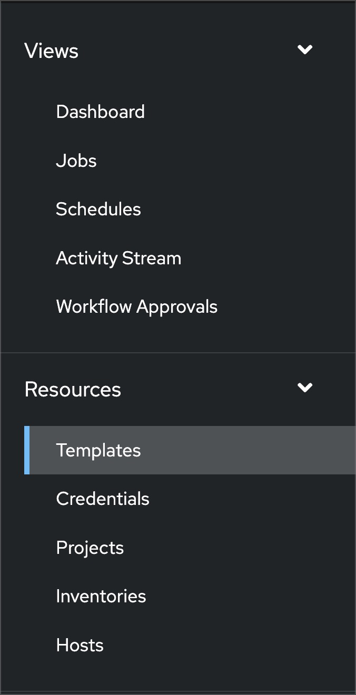

5. Click on the `Cisco SNMP Config` on the right side list of templates.
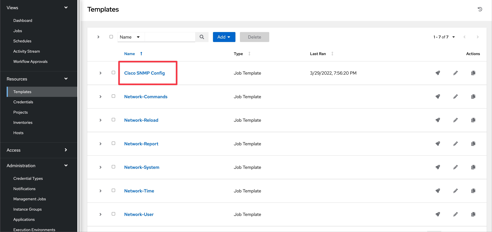

6. Check the Job template details such as `Project`, `Playbook`, `Inventory`,`Execution Environment`,`Credentials`.Note that this job template is under `Student Network Automation Project` and using `playbook.yml`. 


7. Run the job template by clicking on the `Launch` button at the bottom of the details view.

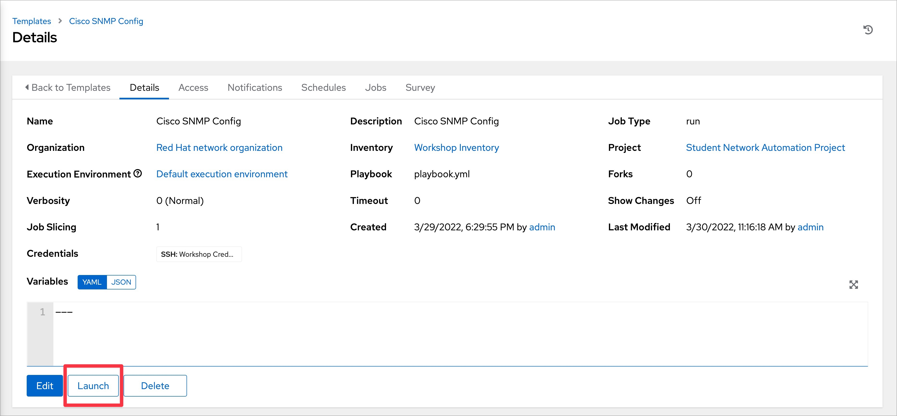

8. Click `Next`. Leave the `Job Type` as `Run` and `Verbosity` as `0(Normal)`. We will change them in the subsequent runs.


9. Click `Launch`.
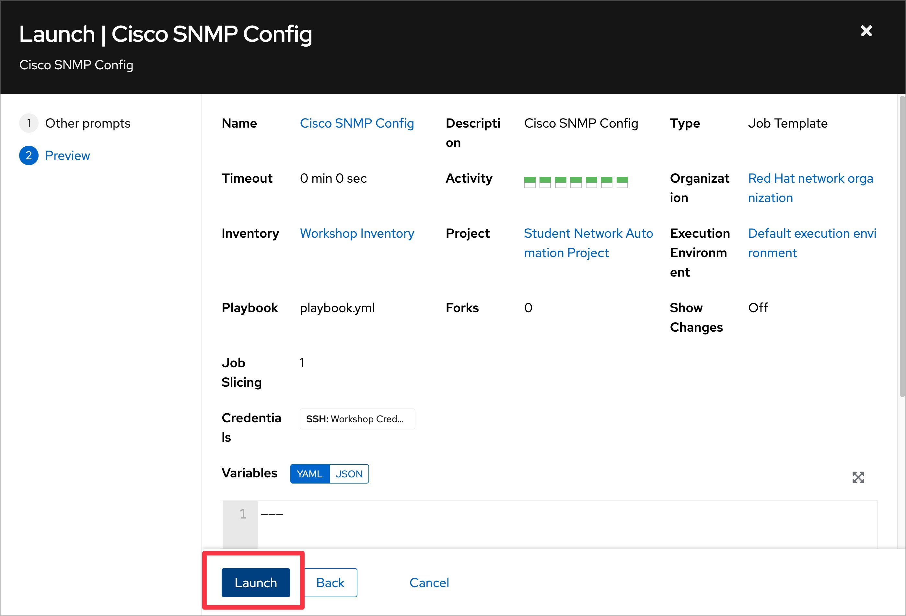

10. Click on `Reload output` if you see the `Event processing complete` message


11. Check the `Output` of the Job run. Note that the task `ensure that the desired snmp strings are present` has status `changed` for `rtr1`. This means that the task has made the changes on the router. We can check the router configuration to verify.

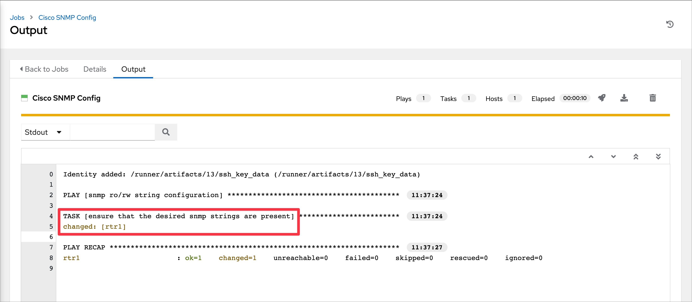


### Step 3 - Verify configuration on router

Verify that the Ansible Playbook worked.  Login to `rtr1` and check the running configuration on the Cisco IOS-XE device using the VSCode Terminal window.

```bash
[student1@ansible network-workshop]$ ssh rtr1

rtr1#show run | i snmp
snmp-server community ansible-public RO
snmp-server community ansible-private RW
```

### Step 4 - Validate idempotency

The `cisco.ios.config` module is idempotent. This means, a configuration change is pushed to the device if and only if that configuration does not exist on the end hosts.

> Need help with Ansible Automation terminology?  
>
> Check out the [glossary here](https://docs.ansible.com/ansible/latest/reference_appendices/glossary.html) for more information on terms like idempotency.

To validate the concept of idempotency, re-run the playbook. Click on the rocket icon on the right side top of the `output` view of the last job run.

 **Alternatively**, This can be initiated by following the `Step 2 - Execute Ansible Playbook` section steps.

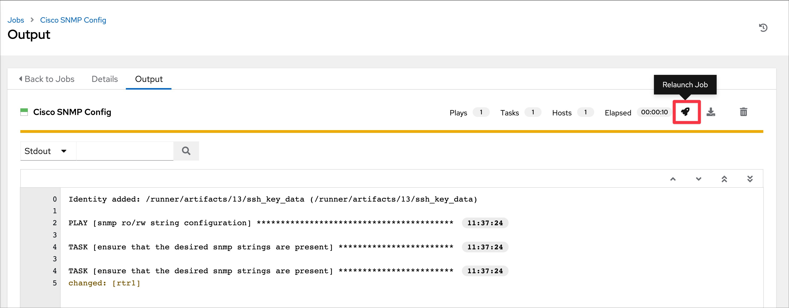

Check the `Output` of the job run. 
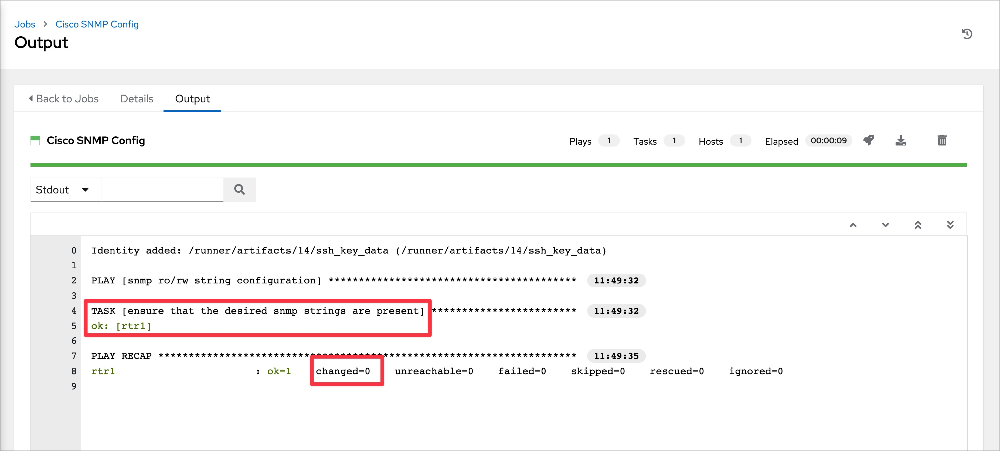


> Note:
>
> See that the **changed** parameter in the **PLAY RECAP** indicates 0 changes.

Re-running the Ansible Playbook multiple times will result in the same exact output, with **ok=1** and **change=0**.  Unless another operator or process removes or modifies the existing configuration on rtr1, this Ansible Playbook will just keep reporting **ok=1** indicating that the configuration already exists and is configured correctly on the network device.

### Step 5 - Modify Ansible Playbook

Now update the task to add one more SNMP RO community string named `ansible-test`.

```sh
snmp-server community ansible-test RO
```

1. Use Visual Studio Code to open the `playbook.yml` file to add the command:


    The Ansible Playbook will now look like this:

    ```yaml
    ---
    - name: snmp ro/rw string configuration
      hosts: cisco
      gather_facts: no

      tasks:

        - name: ensure that the desired snmp strings are present
          cisco.ios.config:
            commands:
              - snmp-server community ansible-public RO
              - snmp-server community ansible-private RW
              - snmp-server community ansible-test RO
    ```

2. Make sure to save the `playbook.yml` with the change.

3. Sync the changes to the controller project. Click on the `Terminal` menu and `Run Task` sub menu.

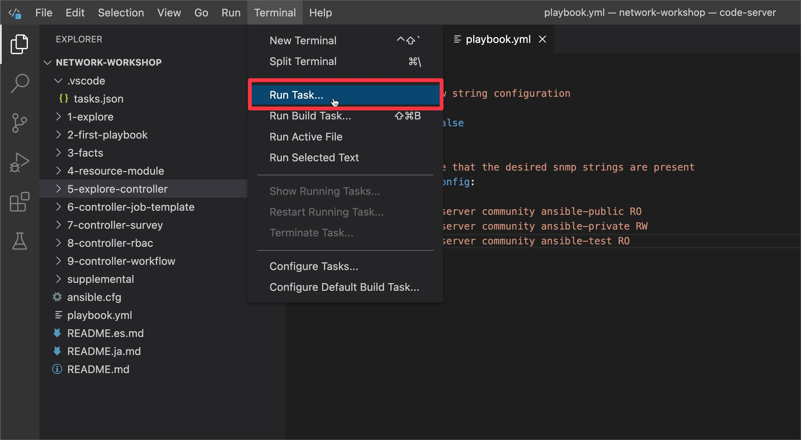

4. Select the `ansible-project-sync` task from the list shown.This syncs the playbooks to the controller `Student Network Automation Project` (/var/lib/awx/projects/student_network_workshop) folder. 

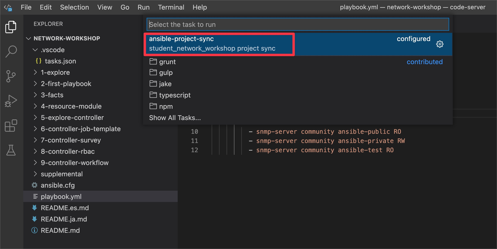

> Note:
> This project sync task is NOT required when running in production with project using SCM like github.
 


### Step 6 - Use check mode

This time however, instead of running the playbook to push the change to the device, execute it using the `Job Type` as `Check` and `Verbosity` as `1(Verbose)`.

Follow the steps in `Step 2 - Execute Ansible Playbook` section steps. Except in `Step 8` select the `Job Type` as `Check` and `Verbosity` as `1(Verbose)` before launching. 

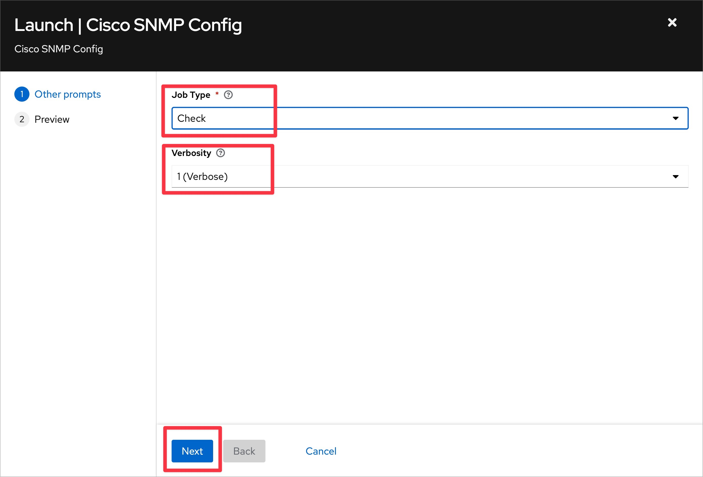

Check the `Output` of the Job run. 

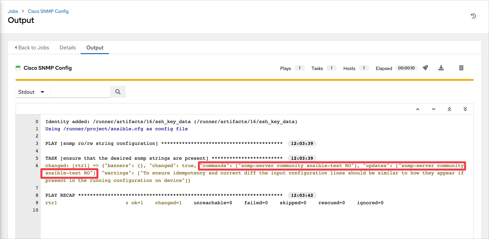


The `check` mode in combination with the `1(verbose)` flag will display the exact changes that will be deployed to the end device without actually pushing the change. This is a great technique to validate the changes you are about to push to a device before pushing it.

You can click on the `changed: [rtr1]` line (line#6) to view the result in JSON format. 

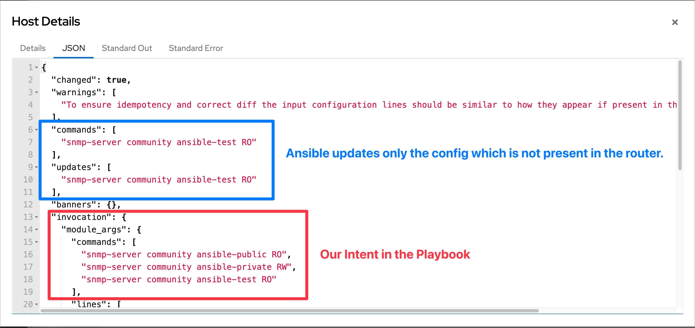


### Step 7 - Verify configuration is not present

Verify that the Ansible Playbook did not apply the `ansible-test` community.  Login to `rtr1` and check the running configuration on the Cisco IOS-XE device.

```bash
[student1@ansible network-workshop]$ ssh rtr1

rtr1#show run | i snmp
snmp-server community ansible-public RO
snmp-server community ansible-private RW
```

### Step 8 - Re-run the Ansible Playbook

Finally re-run this playbook again with `Job Type` as `Run` and `Verbosity` as `0(Normal)`. This will execute the play and make the configuration changes to the router.


### Step 9 - Verify configuration is applied

Verify that the Ansible Playbook applied **ansible-test** community.  Login to `rtr1` and check the running configuration on the Cisco IOS-XE device.

```bash
[student1@ansible network-workshop]$ ssh rtr1

rtr1#sh run | i snmp
snmp-server community ansible-public RO
snmp-server community ansible-private RW
snmp-server community ansible-test RO
```

## Takeaways

* the **config** (e.g. cisco.ios.config) modules are idempotent, meaning they are stateful
* **check mode** ensures the Ansible Playbook does not make any changes on the remote systems
* **verbose mode** allows us to see more output to the terminal window, including which commands would be applied
* This Ansible Playbook could be scheduled in **Automation controller** to enforce the configuration.  For example this could mean the Ansible Playbook could be run once a day for a particular network.  In combination with **check mode** this could just be a read only Ansible Playbook that sees and reports if configuration is missing or modified on the network.

## Solution

The finished Ansible Playbook is provided here for an answer key: [playbook.yml](../playbook.yml).

## Complete

You have completed lab exercise 2

---
[Previous Exercise](../1-explore/README.md) | [Next Exercise](../3-facts/README.md)

[Click here to return to the Ansible Network Automation Workshop](../README.md)
